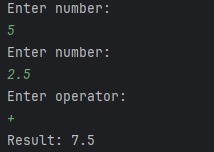
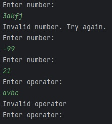
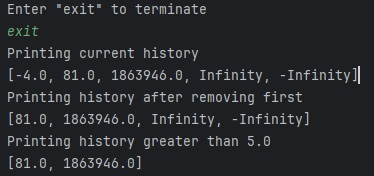
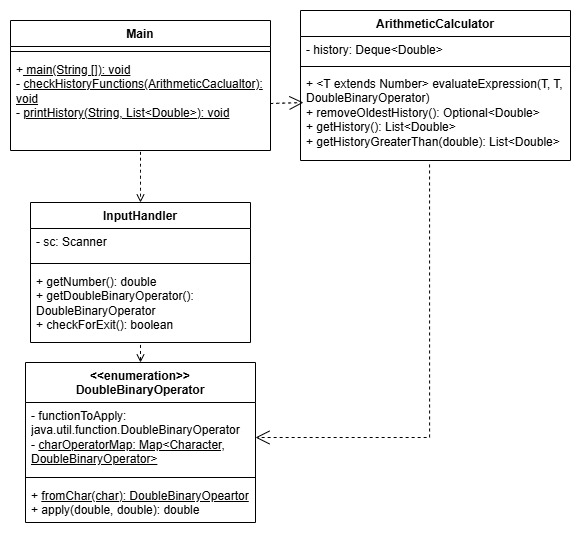

# 내일배움캠프 Ch2 계산기 과제
실수형 사칙연산과 계산 결과 저장이 가능한 계산기이다. 계산 결과 조회의 경우 메소드는 존재하지만, 외부 호출 방법은 별도로 구현하지 않았다.

## 동작
정상 흐름은 다음과 같다. 숫자 두 개와 연산자를 입력하면 결과를 표시한다.



예외 흐름은 다음과 같다. 숫자와 연산자 모두 허용되지 않는 값을 입력하면 사용자에게 다시 요청한다. \
0으로 나눈 경우는 예외를 반환하는 대신 Infinity와 -Infinity로 처리하였고, history 출력 시 대소비교에서는 제외하였다.



"exit"을 입력해 종료할 수 있으며, 종료 시에는 history를 출력한다.



## UML 클래스 다이어그램 (Lv3 기준)



## 고민했던 부분
### 예외의 범위
지금은 예외가 발생할 수 있는 부분이 `parseDouble()`에 의한 `NumberFormatException` 등 크게 없고, 예외 상황 자체도 한정적이지만 나중에는 수많은 예외가 발생할 수 있을 거라 생각했다. 그래서 예외를 어떻게 정의하면 좋을지 알고 싶어 튜터님에게 질문하였으나 예외는 기존 코드, 서비스 상황 등에 따라 너무 다양하기에 일반화하여 말하기가 어렵다고 답변해주셨다. 예외 처리를 더 철저하게 해야 하는 상황이 오면, 학교에서 배웠던 테스트 방법론 관련 이론을 복습한 뒤 적용해보고 싶다.  

### 예외 처리 책임의 분배
예외를 `InputHandler` 클래스에서 잡아서 제대로 된 입력값을 보장할지, 아니면 `Main`에서 선택하도록 해야할지를 고민했다. 관련하여 튜터님에게 질문하였는데, 예외를 던질 것인지 잡을 것인지는 선택의 영역이라고 답변해주셨다. 결국 전체 실행흐름과 예외 흐름, 제약사항을 잘 결정하는 또한 객체지향적 설계 능력이라는 생각이 든다.

### 테스트 가능성
```java
public double getNumber()  {
    while(true) {
        System.out.println("Enter number: ");
        try {
            return Double.parseDouble(sc.nextLine());
        } catch (NumberFormatException e) {
            System.out.println("Invalid number. Try again.");
        }
    }
}
```
숫자 입력을 받을 때 위와 같이 직접 예외를 잡아 처리하다보니 테스트에서 `assertThrows` 같은 assertion을 쓸 수 없었다. 하지만 이는 `println()`으로 결과를 보여주기 때문에 발생하는 문제이고, 특수 결과를 반환하거나 예외를 던지고 `@ControllerAdvice`처럼 공통으로 처러하게 될 것 같아 일단은 넘어가기로 했다.

### 변수 및 메소드 이름
최대한 자기설명적이고 일관적인 변수명과 메소드명을 유지하고자 노력하였다.

## 아쉬운 점
* `DoubleBinaryOperator` 클래스는  함수형 인터페이스와 이름이 겹친다. 하지만 `double`에만 적용 가능하다는 점을 명시하기 위해 유지하였다.
* `<T extends Number>`는 사실 `InputHandler`가 입력이 `double`임을 보장할 수 있으므로 큰 의미가 없다. 내부적으로도 `Number.doubleValue()`를 호출하여 `double`로 변환하기에 특별한 작업을 하지 않는다.
* 파일을 입력 스트림으로 받았다면 결과 입력 결과 테스트를 좀 더 간단히 할 수 있었을 것 같다. 생각해보니 `Scanner`에 다른 스트림을 넣을 수 있게 생성자를 만들어뒀는데 쓰지 않았다.
